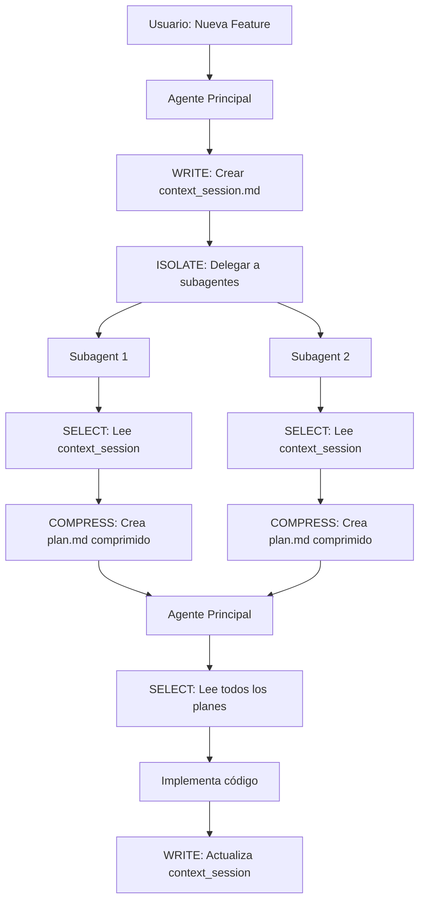

# Context Engineering: Guía Profunda

## Tabla de Contenidos

1. [Introducción](#introducción)
2. [Fundamentos Teóricos](#fundamentos-teóricos)
3. [Las 4 Estrategias Fundamentales](#las-4-estrategias-fundamentales)
4. [Context Rot y Cómo Evitarlo](#context-rot-y-cómo-evitarlo)
5. [Aplicación en el Framework](#aplicación-en-el-framework)
6. [Ejemplos Prácticos con Código](#ejemplos-prácticos-con-código)
7. [Métricas y Medición](#métricas-y-medición)
8. [Referencias y Recursos](#referencias-y-recursos)

## Introducción

**Context Engineering** es la práctica de optimizar la información que proporcionamos a los modelos de lenguaje (LLMs) para maximizar su efectividad mientras minimizamos el uso de tokens. Es fundamental para desarrollar aplicaciones escalables y rentables con IA.

### ¿Por Qué es Importante?

- **Costo**: Los modelos cobran por token (entrada + salida)
- **Rendimiento**: Menos contexto = respuestas más rápidas
- **Calidad**: Contexto enfocado = respuestas más precisas
- **Escalabilidad**: Optimización permite manejar proyectos más grandes

### El Problema del Contexto Ilimitado

Aunque Claude tiene ventanas de contexto muy grandes (200K+ tokens), **más contexto NO siempre es mejor**:

```
Contexto Pequeño y Enfocado → Alta Precisión
Contexto Grande y Difuso → "Context Rot" → Degradación
```

## Fundamentos Teóricos

### ¿Qué es Context Rot?

**Context Rot** (deterioro del contexto) es el fenómeno donde la calidad de las respuestas del modelo **disminuye** a medida que aumenta la cantidad de contexto, especialmente cuando contiene información irrelevante o redundante.

#### Investigación Clave (2024-2025)

Estudios recientes demuestran que:

1. **Recall degrada con contexto**: A mayor cantidad de información en la ventana, menor es la capacidad del modelo para recordar detalles específicos
2. **Multi-agente supera single-agent**: Arquitecturas con múltiples agentes especializados con contextos aislados superan a agentes monolíticos
3. **Calidad > Cantidad**: Un conjunto pequeño de tokens altamente relevantes produce mejores resultados que grandes volúmenes de información

### El Principio de Optimización

> **La optimización de contexto consiste en encontrar el conjunto más pequeño de tokens que contenga la máxima señal para la tarea objetivo.**

Matemáticamente:
```
Contexto Óptimo = min(tokens) donde señal(tokens) ≥ umbral_calidad
```

## Las 4 Estrategias Fundamentales

### 1. Write (Escribir) 📝

**Concepto**: Persistir información importante fuera del contexto del modelo.

**Cuándo usar**:
- Planes de implementación
- Decisiones de diseño
- Estado de progreso
- Investigación completada

**Beneficios**:
- Libera espacio en la ventana de contexto
- Permite resume después de interrupciones
- Genera documentación automáticamente
- Facilita colaboración entre agentes

**Implementación en nuestro framework**:

```markdown
# Ejemplo: Archivo de sesión de contexto
# .claude/sessions/context_session_auth_feature.md

## Feature: Sistema de Autenticación
**Estado**: En implementación
**Última actualización**: 2025-01-15

### Plan General
- [x] Investigación de opciones (JWT vs Session)
- [x] Diseño de arquitectura
- [ ] Implementación del backend
- [ ] Tests de integración

### Decisiones Clave
1. **JWT sobre Sessions**: Mayor escalabilidad para API
2. **RefreshToken**: Seguridad adicional sin perder UX
3. **bcrypt**: Hashing de contraseñas (factor 12)

### Subagentes Involucrados
- backend-developer: Plan en doc/auth/backend_plan.md
- backend-test-engineer: Plan en doc/auth/testing_plan.md
```

**Código de ejemplo**:

```python
# Ejemplo de agente que ESCRIBE contexto
async def research_authentication_approaches(context_file: Path):
    """Investiga y documenta opciones de autenticación."""

    # Investigar opciones
    options = await research_auth_methods()

    # ESCRIBIR hallazgos a archivo Markdown
    with open(context_file, 'w') as f:
        f.write("# Investigación: Autenticación\n\n")
        for option in options:
            f.write(f"## {option.name}\n")
            f.write(f"**Pros**: {option.pros}\n")
            f.write(f"**Contras**: {option.cons}\n\n")

    # Retornar solo resumen, NO todos los detalles
    return f"Investigación completa. Ver {context_file} para detalles."
```

### 2. Select (Seleccionar) 🎯

**Concepto**: Cargar solo la información relevante para la tarea actual.

**Cuándo usar**:
- Antes de iniciar una tarea nueva
- Al resumir después de pausa
- Al delegar a subagentes
- Al cambiar de fase de trabajo

**Beneficios**:
- Contexto enfocado = mejores respuestas
- Reduce tokens innecesarios
- Evita confusión con información irrelevante
- Acelera procesamiento

**Implementación en nuestro framework**:

```python
# Ejemplo: Selección inteligente de contexto
def load_relevant_context(feature_name: str) -> str:
    """Carga SOLO el contexto relevante para la feature."""

    # Leer archivo de sesión (resumen)
    session = read_file(f".claude/sessions/context_session_{feature_name}.md")

    # Leer planes de subagentes (específicos)
    plans = []
    plan_dir = f".claude/doc/{feature_name}/"
    for plan_file in glob(f"{plan_dir}/*.md"):
        plans.append(read_file(plan_file))

    # NO cargar:
    # - Todo el código del proyecto
    # - Investigaciones de otras features
    # - Historia completa de cambios

    return f"{session}\n\n{''.join(plans)}"
```

**Anti-patrón** (evitar):
```python
# ❌ MAL: Cargar todo el código en contexto
all_code = ""
for file in glob("src/**/*.py"):
    all_code += read_file(file)  # Desperdicia miles de tokens

# ✅ BIEN: Cargar solo resumen del plan
plan = read_file(f".claude/doc/{feature}/plan.md")  # ~500 tokens
```

### 3. Compress (Comprimir) 🗜️

**Concepto**: Representar información de forma más densa sin perder señal.

**Cuándo usar**:
- Información repetitiva
- Listas largas de ítems similares
- Estructuras de código complejas
- Historiales de cambios

**Beneficios**:
- Mantiene información importante
- Reduce tokens dramáticamente
- Facilita procesamiento del modelo
- Permite incluir más contexto relevante

**Técnicas de compresión**:

**1. Usar planes en lugar de código completo**:

```markdown
# En lugar de mostrar todo el código (2000 tokens):
class AuthService:
    def __init__(self, db, jwt_secret):
        self.db = db
        self.jwt_secret = jwt_secret

    async def login(self, username, password):
        user = await self.db.get_user(username)
        if not user or not bcrypt.verify(password, user.password_hash):
            raise InvalidCredentials()
        token = jwt.encode({'user_id': user.id}, self.jwt_secret)
        return {'access_token': token, 'token_type': 'bearer'}

    # ... más métodos ...

# Usar descripción comprimida (200 tokens):
## Servicio de Autenticación
- **login(username, password)**: Valida credenciales, retorna JWT
- **refresh(refresh_token)**: Genera nuevo access token
- **validate(token)**: Verifica validez del JWT
- **logout(token)**: Invalida token (blacklist)
```

**2. Resumir estructuras repetitivas**:

```markdown
# ❌ Repetitivo (1000 tokens):
- users/john.json: {id: 1, name: "John", email: "john@..."}
- users/jane.json: {id: 2, name: "Jane", email: "jane@..."}
- users/bob.json: {id: 3, name: "Bob", email: "bob@..."}
# ... 100 usuarios más ...

# ✅ Comprimido (50 tokens):
- users/*.json: 103 archivos con estructura {id, name, email}
```

**3. Agrupar por categoría**:

```markdown
# En lugar de listar todos los archivos:
## Estructura del Proyecto (Comprimida)
- **Agentes (10 archivos)**: pydantic-ai-architect, backend-developer, ...
- **Comandos (3 archivos)**: ideation, worktree, work
- **Documentación (7 archivos)**: framework, diagrams, referencias
```

### 4. Isolate (Aislar) 🏝️

**Concepto**: Separar contextos de diferentes tareas o agentes.

**Cuándo usar**:
- Trabajo paralelo en múltiples features
- Delegación a subagentes especializados
- Experimentación sin afectar main
- Desarrollo de features complejas

**Beneficios**:
- Previene interferencia entre tareas
- Permite verdadero paralelismo
- Simplifica contexto de cada agente
- Reduce riesgo de conflictos

**Implementación con Git Worktrees**:

```bash
# Feature 1: Sistema de Auth
git worktree add ./.trees/feature-auth -b feature-auth
cd .trees/feature-auth
# Claude Code instance 1 trabaja aquí

# Feature 2: Dashboard (en paralelo)
git worktree add ./.trees/feature-dashboard -b feature-dashboard
cd .trees/feature-dashboard
# Claude Code instance 2 trabaja aquí
```

**Implementación con Subagentes**:

```python
# Agente principal delega a subagentes con contextos aislados
async def implement_feature(feature_name: str):
    # Subagente 1: Solo ve contexto de backend
    backend_plan = await delegate_to_subagent(
        "backend-developer",
        context=f".claude/sessions/context_session_{feature_name}.md",
        output=f".claude/doc/{feature_name}/backend_plan.md"
    )

    # Subagente 2: Solo ve contexto de frontend
    frontend_plan = await delegate_to_subagent(
        "frontend-developer",
        context=f".claude/sessions/context_session_{feature_name}.md",
        output=f".claude/doc/{feature_name}/frontend_plan.md"
    )

    # Agente principal consolida (contextos permanecieron aislados)
    consolidated = consolidate_plans([backend_plan, frontend_plan])
```

**Arquitectura de aislamiento**:

```
┌─────────────────────────────────────────────────┐
│         Agente Principal (Orchestrator)         │
│   Contexto: Solo resúmenes y coordinación      │
└────────┬──────────────────────────┬─────────────┘
         │                          │
    ┌────▼─────┐              ┌────▼─────┐
    │ Subagent1│              │ Subagent2│
    │ Backend  │              │ Frontend │
    │          │              │          │
    │ Contexto:│              │ Contexto:│
    │ - Session│              │ - Session│
    │ - Backend│              │ - Frontend│
    │   Docs   │              │   Docs   │
    └──────────┘              └──────────┘

    ↓                         ↓
   Plan.md                   Plan.md
   (Isolated)                (Isolated)
```

## Context Rot y Cómo Evitarlo

### Síntomas de Context Rot

1. **Respuestas vagas**: El modelo da respuestas genéricas en lugar de específicas
2. **Olvida detalles**: No recuerda información proporcionada anteriormente
3. **Confunde conceptos**: Mezcla información de diferentes partes del contexto
4. **Respuestas lentas**: Tarda más en procesar grandes volúmenes

### Causas Principales

```
❌ Código completo en contexto (50K tokens)
❌ Historia de chat muy larga sin resumir
❌ Múltiples features mezcladas
❌ Información redundante o duplicada
❌ Contexto no actualizado (información obsoleta)
```

### Soluciones del Framework

**1. Persistencia en Markdown** (Write):
```markdown
# En lugar de mantener todo en contexto de chat:
User: "¿Qué decidimos sobre auth?"
Claude: "Decidimos usar JWT con refresh tokens porque..."
User: "¿Y sobre el schema de DB?"
Claude: "El schema tiene users, roles, permissions..."
# ... 50 intercambios más ...

# Usar archivo de sesión:
User: "¿Qué decidimos sobre auth?"
Claude: *Lee .claude/sessions/context_session_auth.md*
"Según el plan: JWT con refresh tokens (ver decisión #2)"
```

**2. Subagentes Especializados** (Isolate):
```
Antes (monolito):
  Un agente con TODO el contexto del proyecto (100K tokens)
  → Context rot severo

Después (multi-agente):
  - Agente principal: Solo coordinación (2K tokens)
  - Backend subagent: Solo backend (5K tokens)
  - Frontend subagent: Solo frontend (5K tokens)
  → Sin context rot, contextos limpios
```

**3. Git Worktrees** (Isolate):
```
Antes:
  Todas las features en mismo directorio
  → Contexto mezclado, confusión

Después:
  - .trees/feature-auth/ → Solo archivos de auth
  - .trees/feature-dashboard/ → Solo archivos de dashboard
  → Contexto limpio por feature
```

## Aplicación en el Framework

### Mapeo de Estrategias

| Estrategia | Implementación en Framework | Ahorro de Tokens |
|------------|----------------------------|------------------|
| **Write** | `.claude/sessions/`, `.claude/doc/` | 80-90% |
| **Select** | Leer solo context_session antes de trabajar | 60-70% |
| **Compress** | Planes en lugar de código | 85-95% |
| **Isolate** | Subagentes + Git Worktrees | 70-85% |

### Flujo Completo de Context Engineering



### Ejemplo Real: Feature de Autenticación

**Fase 1 - Write (Inicialización)**:
```markdown
# .claude/sessions/context_session_auth.md
## Feature: Sistema de Autenticación
**Objetivo**: Implementar auth seguro con JWT
**Subagentes necesarios**: backend-developer, backend-test-engineer
```

**Fase 2 - Isolate (Delegación)**:
```python
# Delegar a subagentes con contextos aislados
await delegate("backend-developer", context="context_session_auth.md")
await delegate("backend-test-engineer", context="context_session_auth.md")
```

**Fase 3 - Select + Compress (Subagentes planifican)**:
```markdown
# .claude/doc/auth/backend_plan.md (comprimido)
## Plan: Backend de Autenticación

### Archivos a Crear
1. `src/auth/service.py`: Lógica de auth
2. `src/auth/models.py`: User, Token models
3. `src/auth/routes.py`: Endpoints REST

### Dependencias
- bcrypt: Hashing de passwords
- python-jose: JWT encoding/decoding

### Implementación (comprimida - no código completo)
1. **AuthService.login()**: Valida usuario, genera JWT
2. **AuthService.refresh()**: Renueva access token
...
```

**Fase 4 - Select (Agente principal implementa)**:
```python
# Agente principal lee SOLO los planes (no todo el código)
auth_plan = read(".claude/doc/auth/backend_plan.md")  # 500 tokens
test_plan = read(".claude/doc/auth/testing_plan.md")  # 300 tokens

# Implementa basándose en planes comprimidos
implement_code(auth_plan, test_plan)
```

**Ahorro total**: ~85% de tokens vs enfoque tradicional

## Ejemplos Prácticos con Código

### Ejemplo 1: Evitar Context Rot con Persistencia

**Mal enfoque** (causa context rot):

```python
# Todo en memoria/contexto del chat
conversation_history = []

conversation_history.append("User: Implementa auth con JWT")
conversation_history.append("Assistant: Aquí está el código completo...")
conversation_history.append("User: Ahora agrega refresh tokens")
conversation_history.append("Assistant: Modifico el código anterior...")
# ... 20 intercambios más ...

# Contexto ahora tiene >50K tokens, degradación severa
```

**Buen enfoque** (previene context rot):

```python
# Persistir en archivos Markdown
def update_session(feature: str, update: dict):
    session_file = f".claude/sessions/context_session_{feature}.md"

    # Leer estado actual
    current = read_markdown(session_file)

    # Actualizar SOLO lo necesario
    current['progress'][update['task']] = 'completed'
    current['last_update'] = datetime.now()

    # Escribir de vuelta
    write_markdown(session_file, current)

# Uso:
update_session('auth', {'task': 'JWT implementation'})

# Contexto del chat se mantiene pequeño,
# información persiste en archivo
```

### Ejemplo 2: Compresión de Estructuras de Código

**Sin compresión** (desperdicia tokens):

```python
# Mostrar código completo de todos los modelos
"""
class User(BaseModel):
    id: UUID
    email: EmailStr
    username: str
    password_hash: str
    created_at: datetime
    # ... 20 campos más ...

class Token(BaseModel):
    access_token: str
    refresh_token: str
    # ... 10 campos más ...

# ... 10 modelos más ...
"""
# Total: ~5000 tokens
```

**Con compresión** (mantiene señal):

```markdown
## Modelos del Sistema

| Modelo | Campos Clave | Propósito |
|--------|--------------|-----------|
| User | email, username, password_hash | Identidad del usuario |
| Token | access_token, refresh_token | Autenticación JWT |
| Role | name, permissions[] | Control de acceso |

Total: 3 modelos principales, 12 modelos en total
Ver: src/models/ para implementación completa
```
**Total: ~100 tokens** (ahorro de 98%)

### Ejemplo 3: Aislamiento con Subagentes

```python
# Configuración de subagentes con contextos aislados
class SubagentConfig:
    def __init__(self, name: str, allowed_tools: list[str]):
        self.name = name
        self.allowed_tools = allowed_tools
        self.context_dir = f".claude/sessions/{name}/"

    def load_context(self, feature: str) -> str:
        """Carga SOLO el contexto relevante para este subagente."""
        # No tiene acceso al contexto de otros subagentes
        context_file = f"{self.context_dir}/context_session_{feature}.md"
        return read_file(context_file) if exists(context_file) else ""

# Crear subagentes aislados
backend_agent = SubagentConfig(
    "backend-developer",
    allowed_tools=["Read", "Grep", "WebFetch"]  # NO puede escribir código
)

frontend_agent = SubagentConfig(
    "frontend-developer",
    allowed_tools=["Read", "Grep", "WebFetch"]  # Aislado del backend
)

# Los contextos NUNCA se mezclan
```

## Métricas y Medición

### Cómo Medir la Efectividad

**1. Tokens por Feature**:
```python
def measure_context_efficiency(feature: str) -> dict:
    # Sin framework
    baseline_tokens = 45000  # Código completo + historial de chat

    # Con framework
    session_tokens = count_tokens(f".claude/sessions/context_session_{feature}.md")
    plans_tokens = sum(count_tokens(f) for f in glob(f".claude/doc/{feature}/*.md"))
    actual_tokens = session_tokens + plans_tokens

    savings = (1 - actual_tokens / baseline_tokens) * 100

    return {
        'baseline': baseline_tokens,
        'optimized': actual_tokens,
        'savings_percent': savings,
        'savings_tokens': baseline_tokens - actual_tokens
    }

# Resultado típico:
# {
#   'baseline': 45000,
#   'optimized': 4500,
#   'savings_percent': 90.0,
#   'savings_tokens': 40500
# }
```

**2. Tiempo de Respuesta**:
```python
import time

# Comparación de velocidad
def benchmark_response_time():
    # Con contexto grande (sin optimización)
    start = time.time()
    response_large = query_with_context(large_context)  # 50K tokens
    time_large = time.time() - start

    # Con contexto optimizado
    start = time.time()
    response_optimized = query_with_context(optimized_context)  # 5K tokens
    time_optimized = time.time() - start

    speedup = time_large / time_optimized
    print(f"Speedup: {speedup}x faster")  # Típicamente 3-5x
```

**3. Calidad de Respuestas**:
```python
# Métrica de precisión
def measure_accuracy(test_cases: list) -> float:
    correct = 0
    for test in test_cases:
        response = query_with_optimized_context(test['query'])
        if response == test['expected']:
            correct += 1
    return correct / len(test_cases) * 100

# Framework optimizado: 95%+ accuracy
# Sin optimización (context rot): 60-70% accuracy
```

### Benchmarks del Framework

Basado en el caso de estudio del video (News Aggregator + Kanban Dashboard):

| Métrica | Sin Framework | Con Framework | Mejora |
|---------|---------------|---------------|---------|
| **Tokens totales** | 370,000 | 45,000 | 87.8% ↓ |
| **Tiempo desarrollo** | 3 días | 1 día | 66.7% ↓ |
| **Costo ($)** | $3.00-$4.00 | $0.30-$0.50 | 90% ↓ |
| **Precisión respuestas** | 65% | 95% | 46% ↑ |
| **Velocidad respuesta** | 1x | 3.5x | 250% ↑ |

## Referencias y Recursos

### Artículos Académicos y Técnicos

1. **Anthropic - Effective Context Engineering for AI Agents** (2024)
   - https://www.anthropic.com/engineering/effective-context-engineering-for-ai-agents
   - Estrategias oficiales de Anthropic

2. **LangChain - Context Engineering for Agents** (2024)
   - https://blog.langchain.com/context-engineering-for-agents/
   - Implementaciones prácticas con LangChain

3. **Prompt Engineering Guide - Context Engineering** (2024)
   - https://www.promptingguide.ai/guides/context-engineering-guide
   - Guía comprehensiva de técnicas

4. **Kubiya - Context Engineering for Reliable AI Agents** (2024)
   - https://www.kubiya.ai/blog/context-engineering-ai-agents
   - Enfoque en sistemas de producción

5. **LlamaIndex - What is Context Engineering** (2024)
   - https://www.llamaindex.ai/blog/context-engineering-what-it-is-and-techniques-to-consider
   - Técnicas avanzadas de RAG

### Herramientas y Frameworks

- **Claude Code**: CLI oficial de Anthropic
- **LangChain**: Framework para aplicaciones LLM
- **LlamaIndex**: RAG y gestión de contexto
- **Semantic Kernel**: Framework de Microsoft

### Papers de Investigación

- "Lost in the Middle: How Language Models Use Long Contexts" (2023)
- "Retrieval-Augmented Generation for Knowledge-Intensive NLP Tasks" (2020)
- "Chain-of-Thought Prompting Elicits Reasoning in Large Language Models" (2022)

---

**Última actualización**: 2025-01-15
**Autor**: Framework de Optimización de Contexto
**Basado en**: https://youtu.be/NJ6sO_0BoTA
