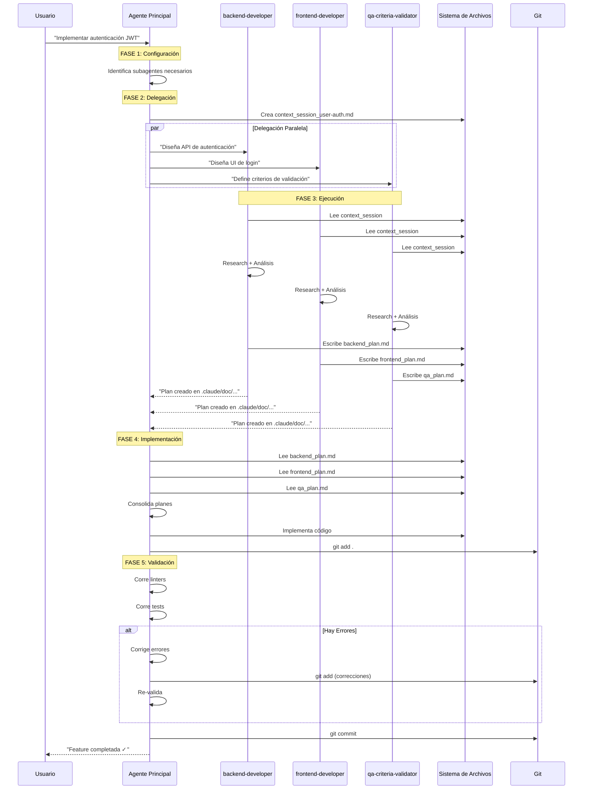

# Análisis Detallado del Diagrama del Framework

Este documento analiza en profundidad el diagrama visual del framework presentado en `anexos/framework.png`.

## Estructura del Diagrama

El diagrama se divide en dos vistas complementarias:

### Vista Izquierda: El Camino del Flujo de Trabajo

Representa visualmente las 5 fases como un **camino de desarrollo** que el proyecto recorre:

```
🛣️ CAMINO DE DESARROLLO

┌──────────────┐
│   INICIO     │ ← Fase 1: Configuración de Sub-Agentes
│      ↓       │   - Identificar subagentes necesarios
└──────────────┘   - Preparar contexto inicial

┌──────────────┐
│   CURVA 1    │ ← Fase 2: Delegación de Tareas
│      ↓       │   - Delegar en paralelo
└──────────────┘   - Pasar context_session

┌──────────────┐
│   CURVA 2    │ ← Fase 3: Ejecución de Sub-Agentes
│      ↓       │   - Subagentes investigan
└──────────────┘   - Crean planes detallados

┌──────────────┐
│   CURVA 3    │ ← Fase 4: Implementación de Características
│      ↓       │   - Agente principal implementa
└──────────────┘   - git add + validaciones

┌──────────────┐
│   LLEGADA    │ ← Fase 5: Corrección de Errores
│              │   - Corrección de linters
└──────────────┘   - git commit final
```

### Vista Derecha: Diagrama Técnico de Flujo

Muestra el flujo de **datos e información** entre componentes:

```
┌────────────────────────────────────────────────┐
│           PLANIFICACIÓN                        │
│  ┌──────────────────────────────────────┐      │
│  │ Feature Request (Usuario)            │      │
│  └─────────────┬────────────────────────┘      │
│                │                               │
│  ┌─────────────▼────────────────────┐          │
│  │   Agente Principal               │          │
│  │   - Analiza request              │          │
│  │   - Identifica subagentes        │          │
│  └─────────────┬────────────────────┘          │
│                │                               │
│      ┌─────────┼─────────┐                     │
│      │         │         │                     │
│  ┌───▼───┐ ┌──▼───┐ ┌───▼───┐                  │
│  │Sub 1  │ │Sub 2 │ │Sub 3  │                  │
│  │Backend│ │Front │ │  QA   │                  │
│  └───┬───┘ └──┬───┘ └───┬───┘                  │
│      │        │         │                      │
│      │ Escribe│Escribe  │Escribe               │
│      │        │         │                      │
│  ┌───▼────────▼─────────▼───┐                  │
│  │ .claude/sessions/         │                 │
│  │ context_session_*.md      │                 │
│  └──────────┬────────────────┘                 │
└─────────────┼──────────────────────────────────┘
              │
┌─────────────▼────────────────────────────────┐
│      IMPLEMENTACIÓN DE TAREAS                │
│  ┌───────────────────────────────┐           │
│  │ Agente Principal              │           │
│  │ - Lee context_sessions        │           │
│  │ - Lee planes en .claude/doc/  │           │
│  └───────────┬───────────────────┘           │
│              │                               │
│  ┌───────────▼───────────────┐               │
│  │ Implementa Código         │               │
│  │ - Crea/modifica archivos  │               │
│  │ - Sigue planes            │               │
│  └───────────┬───────────────┘               │
│              │                               │
│  ┌───────────▼───────────────┐               │
│  │ git add                   │               │
│  │ Prepara cambios           │               │
│  └───────────┬───────────────┘               │
└──────────────┼───────────────────────────────┘
               │
┌──────────────▼─────────────────────────────────┐
│      IMPLEMENTACIÓN COMPLETA                   │
│  ┌───────────────────────────────┐             │
│  │ Validación & Linting          │             │
│  │ - Corre validadores           │             │
│  │ - Identifica errores          │             │
│  └───────────┬───────────────────┘             │
│              │                                 │
│       ┌──────▼──────┐                          │
│       │ ¿Errores?   │                          │
│       └──┬───────┬──┘                          │
│          │ Sí    │ No                          │
│    ┌─────▼─┐   ┌─▼─────────┐                   │
│    │Corrige│   │git commit │                   │
│    │Errores│   │  DONE ✓   │                   │
│    └───┬───┘   └───────────┘                   │
│        │                                       │
│        └──────→ (Loop hasta sin errores)       │
└────────────────────────────────────────────────┘
```

## Puntos de Sincronización Entre Subagentes

### Punto 1: Archivo de Contexto Compartido

Todos los subagentes leen el mismo archivo de contexto inicial:

```
.claude/sessions/context_session_{feature}.md
```

Este archivo contiene:
- Objetivo de la feature
- Restricciones conocidas
- Estado actual del proyecto
- Decisiones arquitectónicas previas

### Punto 2: Planes Independientes

Cada subagente genera su propio plan SIN interferir con otros:

```
.claude/doc/{feature}/
  ├── backend_plan.md      ← Subagent: backend-developer
  ├── frontend_plan.md     ← Subagent: frontend-developer
  └── qa_plan.md           ← Subagent: qa-criteria-validator
```

**Clave:** No hay conflictos porque cada subagente escribe en su propio archivo.

### Punto 3: Consolidación por Agente Principal

El agente principal es el único que lee TODOS los planes y los consolida en una implementación cohesiva.

## Flujo de Archivos: Sesión → Plan → Implementación → Commit

### 1. Archivo de Sesión (Compartido)

```markdown
# .claude/sessions/context_session_user-auth.md

## Objective
Implement JWT-based user authentication

## Context
- Using FastAPI for backend
- React for frontend
- Need to support refresh tokens
- Must be production-ready

## Constraints
- No external auth providers (pure JWT)
- Token expiry: 15 min access, 7 days refresh
- Secure password hashing
```

### 2. Planes de Subagentes (Individuales)

**Backend Plan:**
```markdown
# .claude/doc/user-auth/backend_plan.md

## API Endpoints

POST /auth/register
- Input: email, password
- Output: user_id, access_token, refresh_token

POST /auth/login
- Input: email, password
- Output: access_token, refresh_token

POST /auth/refresh
- Input: refresh_token
- Output: new_access_token

## Database Schema
...
```

**Frontend Plan:**
```markdown
# .claude/doc/user-auth/frontend_plan.md

## Components to Create

1. LoginForm.tsx
2. RegisterForm.tsx
3. AuthContext.tsx
4. ProtectedRoute.tsx

## State Management
- Use Context API for auth state
- Store tokens in httpOnly cookies
...
```

### 3. Implementación (Agente Principal)

```
Agente Principal:
1. Lee context_session_user-auth.md
2. Lee backend_plan.md
3. Lee frontend_plan.md
4. Implementa en orden:
   a. Database models
   b. API endpoints
   c. Frontend components
   d. Integration
```

### 4. Commit (Final)

```bash
git add .
# Validaciones pasan
git commit -m "feat: implement JWT authentication

- Add user registration and login endpoints
- Implement token refresh mechanism
- Create frontend auth components
- Add protected route wrapper

🤖 Generated with Claude Code
Co-Authored-By: Claude Sonnet 4.5 <noreply@anthropic.com>"
```

## Diagrama de Secuencia (Mermaid)



## Ventajas de Esta Arquitectura

### 1. Escalabilidad

Puedes agregar tantos subagentes como necesites sin modificar el flujo:

```
Feature Compleja:
- backend-developer
- frontend-developer
- database-architect
- security-specialist
- performance-optimizer
- qa-criteria-validator

Todos trabajan en paralelo, todos escriben sus planes, agente principal consolida.
```

### 2. Trazabilidad

Cada archivo persiste para siempre:

```
.claude/doc/user-auth/
  ├── backend_plan.md        ← Decisiones de backend
  ├── frontend_plan.md       ← Decisiones de frontend
  ├── qa_plan.md             ← Criterios de calidad
  └── implementation_log.md  ← Lo que realmente se hizo
```

### 3. Recuperabilidad

Si algo sale mal, puedes volver a cualquier punto:

```bash
# Ver planes originales
cat .claude/doc/user-auth/backend_plan.md

# Resumir desde ese punto
/resume {agentId}

# O empezar fresh con el mismo plan
claude --permission-mode plan
> "Implementa la autenticación siguiendo el plan en .claude/doc/user-auth/"
```

### 4. Paralelización Real

Con worktrees, múltiples features pueden estar en diferentes fases simultáneamente:

```
Worktree 1: feature-auth → FASE 5 (Corrección)
Worktree 2: feature-dashboard → FASE 3 (Subagentes trabajando)
Worktree 3: feature-reports → FASE 1 (Configuración)
Main: Research de nueva feature → FASE 0 (Ideación)
```

## Conclusión

El diagrama no es solo una representación visual: es un **blueprint arquitectónico** que define:

1. **Roles claros:** Quién hace qué
2. **Flujo unidireccional:** Información fluye en una dirección clara
3. **Puntos de sincronización:** Archivos compartidos vs archivos individuales
4. **Checkpoints:** Cada fase tiene criterios de salida claros
5. **Escalabilidad:** El patrón funciona con 1 o 100 subagentes

Este diseño permite trabajar con Claude Code no como una herramienta, sino como un **equipo de desarrollo distribuido** donde cada miembro tiene experticia específica y responsabilidades claras.
